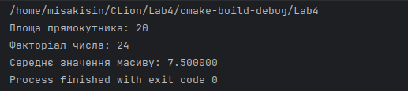

<h1 align="center">Лабораторна робота №4</h1>
Тема: Основи мови С  
Виконав: Федотов Євгеній Євгенович  
Прийняв: Дребезов Денис Олегович  
Група 6.1221
<h3>Умова завдання:</h3>
- Завдання 1
Напишіть програму, яка обчислює площу прямокутника за допомогою змінних для довжин сторін.
 
- Завдання 2
Напишіть функцію для обчислення факторіалу числа.
 
- Завдання 3
Створіть програму для обчислення середнього значення масиву чисел.
<h3>Виконання:</h3>
Значення для обрахунку площи прямокутника 4 та 5.  
Значення для обрахунку факторіалу 4.  
Масив складається зі значень 8 иа 7. 

